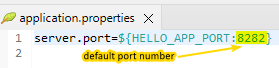

## Key sub-folders

```
hello-workflow
├───.github       (GitHub actions and workflow artifacts)
├───docker-setup  (Docker compose projects orgainsed in sub-folders)
├───documentation (The folder holding this document)
└───hello         (Spring-Boot java application source)
```


<br/>
<br/>
<br/>

## Running the application

### A. Running the application inside the IDE
Nothing should change. The application should run as usual<br/>
Note, the port number used will depend on whether the env var `HELLO_APP_PORT` is set and effective or not. If the env var is not set then the default port, set in application.properties, will be used.<br/>



<br/>
<br/>
<br/>


### B. Running the application as a docker compose project
1. `cd path/to/docker-setup/hello-app`
2. `docker-compose up -d`

#### Points to note
- If there is a .env file in the `path/to/docker-setup/hello-app` folder then the settings there will be used, else the default settings will be used
- To create a `.env` file make a copy of the `sample.env` file and save it as `.env` in the same folder. To change the settings update this file.
- The compose project expects to find a ready built jar file in the target folder of the spring-boot project


<br/>
<br/>
<br/>


### C. Running the application on a remote host (using workflow)
We want to be able to deploy the hello spring boot app by building it from source merged into main in the repository and then start the application on the remote host by running it inside a docker container

#### Setting up the remote host
The GitHub workflow will need to be able to securely access the remote host to copy artifacts from the repository and to execute commands on the remote host.<br/>
To be able to do this the following concerns need to be addressed on the remote
 - Setup credentials for use by the workflow to access the remote host
 - Permissions to read, write and execute in an area on the remote host
 - Manage docker and run docker commands

##### Setting up workflow access to remote host
The workflow downloads the package built and uploaded to GitHub Package by the `build-do_test-package` workflow
The downloaded package is then pushed to a remote host via sftp. To do that the workflow requires sftp credentials. So these need to be created and setup on the remote host then copied and saved securely in GitHub secrets

1. Creating unix user account on remote host for use by the workflow
    a) ssh into remote host with a privileged login e.g. root
    b) Before creating the user check it is not alread created
       `awk -F':' '{ print $1}' /etc/passwd | grep ghwfuser`
    c) If the user already exists and you want to start afresh delete the user
       `userdel ghwfuser`
    d) Create the user with a default profile
        `useradd -s /bin/bash -m -c "Functional account for use by github workflows" ghwfuser`
           Note:
           -s /bin/bash: sets the default shell
           -m : creates home directory for the user
           -c : adds an informative comment
    e) Set the password for the new user
        `passwd ghwfuser`
    f) Logout and try logging back with the newly created credentials


2. Create ssh keys for use by the workflow
    a) On your local machine (if on windows, start up a wsl linux shell) start up *nix terminal
    b) Generate keys by running
        `ssh-keygen`
         The process will pause and prompt the following.
		 
           >>Generating public/private rsa key pair.
           >>Enter file in which to save the key (/home/some-user/.ssh/id_rsa): /path/to/keys/dir/private-key-file
           
		 Provide the requested info
		 
         The process will pause again and prompt for a passphrase. In this case just press enter at both prompts
		 
			>>Enter passphrase (empty for no passphrase):
			>>Enter same passphrase again:
		 
         Finally the process should complete with something like the following
		 
			>>Your identification has been saved in /path/to/keys/dir/private-key-file
			>>Your public key has been saved in /path/to/keys/dir/public-key-file
			>>The key fingerprint is:
			>>SHA256:i/m2GzZho4N9Jgw5toMxFGiBE3LvoSkgYBW1bb6+zx4 somone@localmachine
			>>The key's randomart image is:
			>>+---[RSA 3072]----+
			>>|===oo.           |
			>>|Bo o  o          |
			>>|+.. o. o         |
			>>|o. + oo          |
			>>|. = *  .S        |
			>>| . = B =.+       |
			>>|  . + O.BE       |
			>>|     ..Boo.      |
			>>|       +B*       |
			>>+----[SHA256]-----+

    c) Ensure the private key is kept securely. Ideally it should be deleted once copied and tested on GitHub-Secrets


3. Copy the public key to the remote host using a utility called `ssh-copy-id`
     a) `ssh-copy-id -i /path/to/keys/dir/public-key-file ghwfuser@remote_host`<br/>
        This should come up with the following output and pause for you to login
		
			>>/usr/bin/ssh-copy-id: INFO: Source of key(s) to be installed: "/path/to/keys/dir/public-key-file"
			>>/usr/bin/ssh-copy-id: INFO: attempting to log in with the new key(s), to filter out any that are already installed
			>>/usr/bin/ssh-copy-id: INFO: 1 key(s) remain to be installed -- if you are prompted now it is to install the new keys
			>>ghwfuser@remote_host's password:
			>>
			>>Number of key(s) added: 1
			>>
			>>Now try logging into the machine, with:   "ssh 'ghwfuser@remote_host'"
			>>and check to make sure that only the key(s) you wanted were added.


4. Login using the keys to test everything works
     a) `ssh -i /path/to/keys/dir/private-key-file ghwfuser@remote_host`<br/>
            If everything is fine you should be able to login without issues.


5. Setup GitHub-Secrets with the following parameters.<br/>
    (Note: For REMOTE_SSH_KEY and REMOTE_USERNAME use the credentials created and tested above)<br/>
     REMOTE_FILEPATH<br/>
     REMOTE_PORT<br/>
     REMOTE_SERVER<br/>
     REMOTE_SSH_KEY<br/>
     REMOTE_USERNAME<br/>

6. Set unix permissions for the newly created ghwfuser
    The newly created user will need read, write and execute permissions on remote host locations where the
    workflow is setup to push artifacts to


7. Add ghwfuser to the docker group to be able start docker compose projects
      `sudo usermod -a -G docker ghwfuser`

<br/>
<br/>
<br/>


## Enabling TLS (https)

### Prerequisites
1. Domain name is registered
2. Remote host is running with a known ip-address

### Key steps
1. Update DNS record to point to remote host's ip-addresses
2. Test the DNS record has been updated by accessing the application using a url with the domain name instead of ip-address
3. Request a certificate. Use the notes [here](https://github.com/mp30028/notes/wiki/ssl) to help do that.
4. Make code changes to use TLS

### Certificate request command history (requested for mp30028.com on 2023-07-09)

#### Installing snap
```
apt update
apt upgrade
apt install snapd
reboot
```

#### Testing snap is working
```
snap install hello-world
hello-world
```

#### Install certbot with snap

1. First remove any legacy installations
`apt remove certbot`

2. Now install certbot
`snap install --classic certbot`

#### Create symlink so that when certbot installs the cert it is available in the /usr/bin/certbot directory as well
`ln -s /snap/bin/certbot /usr/bin/certbot`

#### Request the cert using the installed certbot app
`certbot certonly`


#### Result of running certbot to get cert for mp30028.com

```
Successfully received certificate.
Certificate is saved at: /etc/letsencrypt/live/mp30028.com/fullchain.pem
Key is saved at:         /etc/letsencrypt/live/mp30028.com/privkey.pem
This certificate expires on 2023-10-07.
These files will be updated when the certificate renews.
Certbot has set up a scheduled task to automatically renew this certificate in the background.
```

---

<br/>
<br/>
<br/>


## Create test certificate for development and testing purposes on localhost
Use openssl on linux to run the multiline command shown below. It should generate two files localhost.crt and localhost.key

```
openssl \
req -x509 \
-out localhost.crt \
-keyout localhost.key \
-newkey rsa:2048 \
-nodes \
-sha256 \
-subj '/CN=localhost' \
-extensions EXT -config <( \
printf "\
[dn]\n\
CN=localhost\n\
[req]\n\
distinguished_name=dn\n\
[EXT]\n\
subjectAltName=DNS:localhost\n\
keyUsage=digitalSignature\n\
extendedKeyUsage=serverAuth\
")
```

### Convert the test certificate to pkcs12 format

openssl pkcs12 -export -out localhost.p12 -inkey localhost.key -in localhost.crt